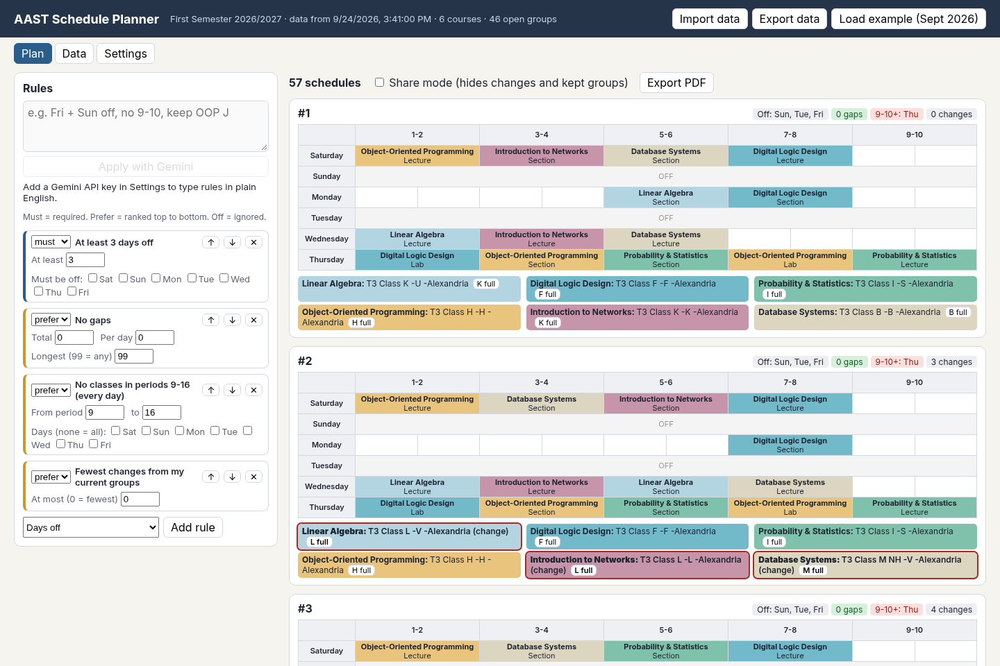
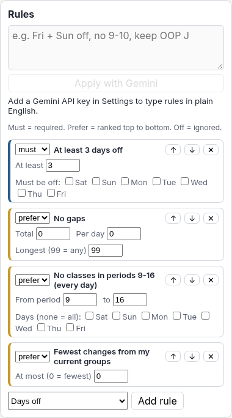
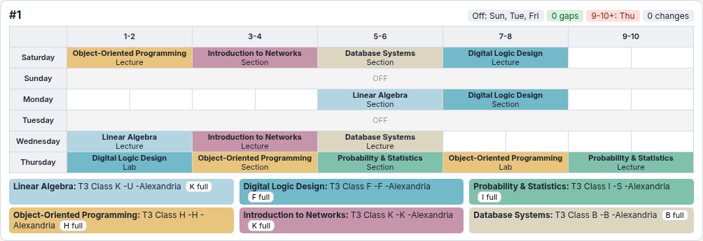
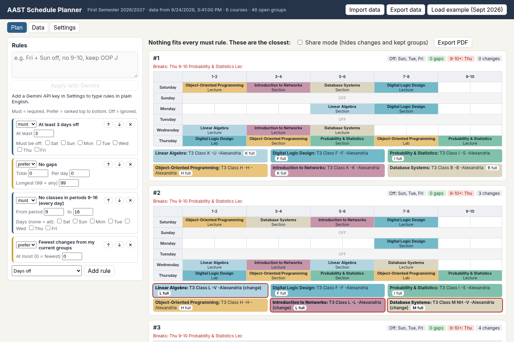
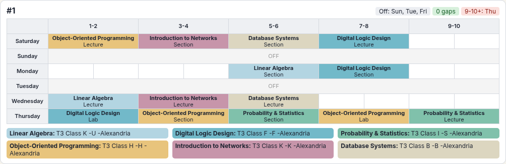
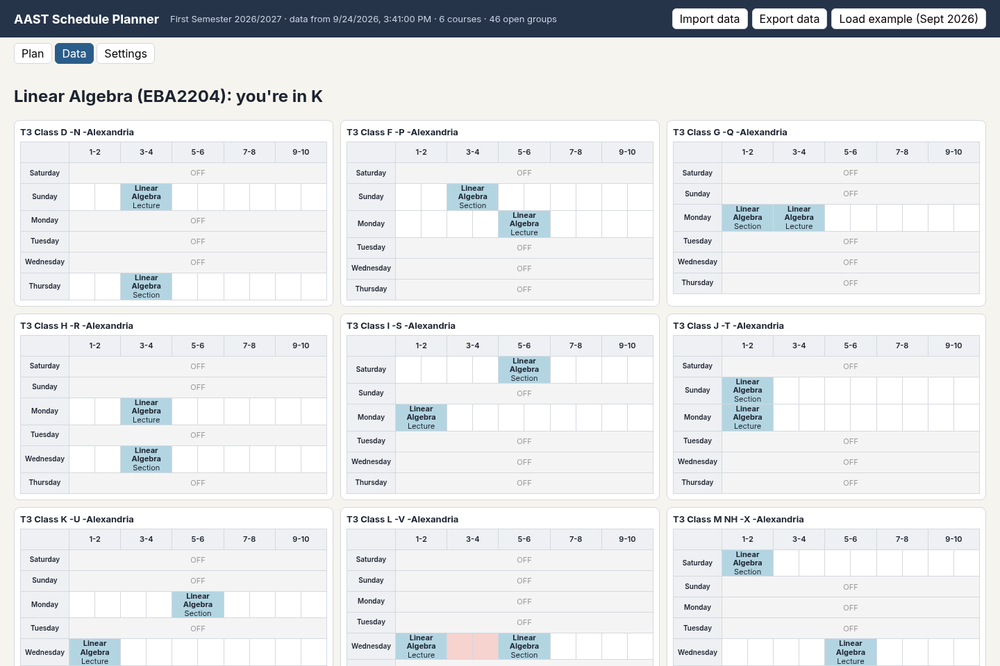
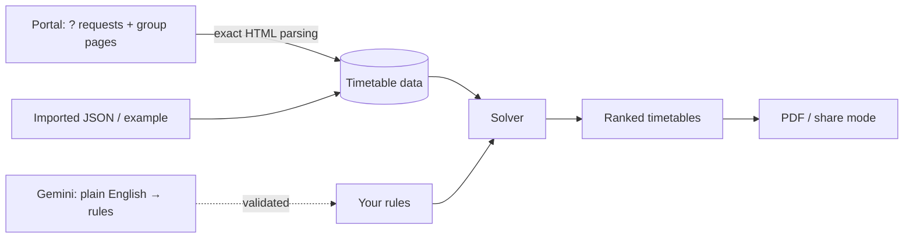

# AAST Schedule Planner

[](https://github.com/ghatwary06/aast-scheduler/actions/workflows/ci.yml)

**Find every clash-free university timetable that fits your life, in milliseconds.**

A Brave/Chrome extension for AASTMT students. You tell it what you want ("Fridays and Sundays off, no gaps, nothing after 7-8, stay in my friend's OOP group"), and it searches every combination of course groups. It ranks the schedules that fit and shows them as colour-coded timetables you can export to PDF.



## Why

Registration at AASTMT means picking one **group** per course, and each group comes with its own lecture, section and lab times. With 6 courses and up to 16 groups each, that's over 150,000 combinations, and that's only counting the groups that still have seats. When a single section changes time, the portal can reshuffle you into groups you never chose. Finding a good replacement by hand means screenshotting every group and checking clashes one by one, which takes hours.

This extension does it exhaustively and instantly. It tells you which groups to pick, and it shows the closest alternatives when your wishes are impossible.

## Features

### Live import from the registration portal

Open **Change Registered Courses**, click the extension, and press **Read this page's groups**. In about a minute it reads, for every course:
- every group's lectures, sections and labs
- which groups are **open** and which are **full**
- which group you're in now

It reads by sending the same requests the portal's **?** buttons send, in the background. Nothing on the page is clicked or changed.

### Rules you control

Each rule can be a **must** (a hard filter), a **prefer** (ranked, top of the list matters most) or **off**:

| Rule | Example |
|---|---|
| Days off | at least 3 days off, Sunday must be free |
| Gaps | no gaps, or at most 1 per day |
| Banned periods | nothing in 9-10 |
| Start/finish window | classes only between periods 1 and 8 on Thursday |
| Keep / avoid a group | stay in OOP J; never Linear Algebra K |
| Fewest changes | stay as close as possible to your current groups |
| No wasted days | no day with only one class |



### Plain-English rules (optional, via Gemini)

Type *"Fri + Sun off, no 9-10, keep OOP J"* and Gemini fills in the rule settings.
- **Validated first:** every rule it returns is checked, and anything invalid is rejected instead of applied.
- **Easy to review:** the rules it changed are highlighted, so you can check them before trusting the results.
- **Your key stays yours:** it lives in the browser and is sent only to Google's Gemini API. If one model hits its free-tier limit, it falls back to the next.

### Results you can act on

Every result is a full timetable, with:
- its days off, gaps and late days
- how many groups you'd change
- **the exact dropdown names to pick in the portal**

Groups with identical times are merged ("Database G *or* H"), which gives you a backup if one fills up.



### When nothing fits, it shows the closest

If your must rules are impossible, you still get the schedules that break the fewest rules, each labelled with exactly what it breaks.



### Mark a group as full, and re-solve instantly

A group turned out to be full when you tried to switch? One click removes it and re-ranks everything.

### Share with friends

Share mode hides your personal changes and kept groups, and **Export PDF** turns the results into a clean document for the group chat.



### See every group

The Data tab shows each course's groups side by side, with full groups greyed out. When you import newer data, it lists every group that moved or filled up.



## It never touches your registration

The planner only **reads** timetables. Nothing in it can send **Confirm Registration**, **Select**, **Delete**, **Add**, **Insert** or **Logout**, or change a dropdown. That's enforced in layers, and every layer is tested:

1. **Requests, not clicks.** The reader never clicks anything. Every request it makes must pass an allowlist: group pages (`?pg=N`), or one POST that presses exactly one **?** button, with no postback target. Anything else is refused before it leaves the browser. The 🗑 button that sits right next to each ? is refused by name.
2. **A denylist that always wins.** Confirm, Delete, Add, Insert, Logout and dropdown postbacks are rejected even if something slipped past the allowlist.
3. **A form-submit and postback blocker** runs inside the portal page while reading, so not even an accidental click can submit the form.
4. **A source scan** fails the build if portal-facing code ever writes to a form field.
5. **Minimal permissions.** The extension only gets access to the portal tab when you open its popup there (`activeTab`), and it has no standing access to the site.

If the portal shows something unexpected (a different course than asked, a logout, a layout it can't read), the reader stops or skips that group with a warning. It never guesses.

## How it works



- **The solver** is a backtracking search over one group per course. It uses bitmask clash checks and prunes early on hard rules. Results are ranked lexicographically by your preference order, with no weights to tune. On real portal data (155,000+ combinations), a full search takes about 10 ms.
- **The portal parsers** read the timetable straight from the page's HTML, following the table's `colspan`/`rowspan` layout, so even classes stacked in one slot are read correctly. They never read pixels or screenshots, so there's no guessing. They were tested against real portal pages, with all personal data removed by `tools/sanitize-portal-page.py`.
- **There's no framework and no server:** vanilla TypeScript, bundled by Vite into a Manifest V3 extension under 50 KB.

## Try it

```bash
git clone https://github.com/ghatwary06/aast-scheduler.git
cd aast-scheduler
npm ci
npm run build
```

1. Open `brave://extensions` (or `chrome://extensions`) and turn on **Developer mode**.
2. Click **Load unpacked** and select the `dist/` folder.
3. Click the extension icon, then **Open planner**, then **Load example**. The example is real Fall 2026 group times for 6 computer-science courses.
4. **With your own data:** log into the registration portal and press **Change Registered Courses**. Then click the extension icon and **Read this page's groups**. When it's done, **Open planner**.

Or preview it without installing: `npm run build && npm run preview`, then open <http://localhost:4173/app/app.html?demo>.

## Development

```bash
npm test             # solver, rules, portal parsers, safety guard, reader, UI
npm run typecheck
npm run screenshots  # regenerate docs/screenshots (needs `npm run preview` running)
```

| Folder | What's in it |
|---|---|
| `src/core/` | data format, rule evaluation, solver (no DOM) |
| `src/portal/` | portal page parsers, the request guard, the reader, and the safety guard |
| `src/content/` | the two scripts injected into the portal tab (reader + submit blocker) |
| `src/app/`, `src/popup/` | the extension's pages |
| `tests/` | Vitest + jsdom; fixtures are sanitized real portal pages |
| `docs/superpowers/` | the design spec and step-by-step build plans |
| `tools/` | fixture sanitizer, screenshot script, content-script build |

## Roadmap

- **PDF import:** read the schedule PDFs AASTMT publishes before registration opens.

## Credits

Built with [Claude Code](https://claude.com/claude-code), Anthropic's AI coding assistant. The requirements, real portal pages and testing came from [@ghatwary06](https://github.com/ghatwary06). Not affiliated with AASTMT.

The example data's "current registration" belongs to a made-up student.

## License

[MIT](LICENSE)
